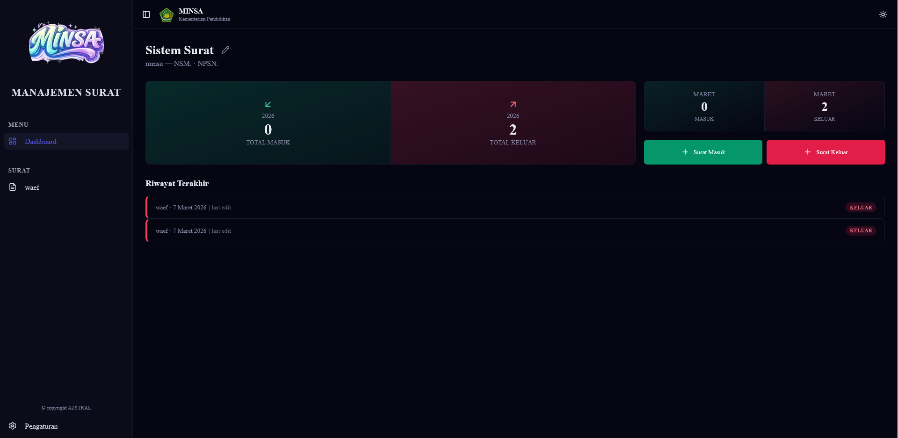

# MINSA - pengelola surat

>only another ai code

> A brief, catchy tagline describing what the Electron app does.



## Table of Contents
- [Features](#features)
- [Installation](#installation)
- [Usage](#usage)
- [Development](#development)
- [Scripts](#scripts)
- [License](#license)

## Features
- ✅ Desktop application (Windows)  
- 🖥️ UI built with **HTML**, **CSS**, and **TypeScript**  
- 🔌 Native OS integrations via Electron APIs  


## Installation

### Pre‑built binaries
Download the latest release from the [Releases page](https://github.com/your‑username/your‑repo/releases) and run the installer for your OS.

### From source
```bash
# Clone the repo
git clone https://github.com/your-username/your-repo.git
cd your-repo

# Install dependencies
npm ci

# Build and package
npm run build   # compiles TypeScript & bundles assets
npm run package # creates OS‑specific installers
